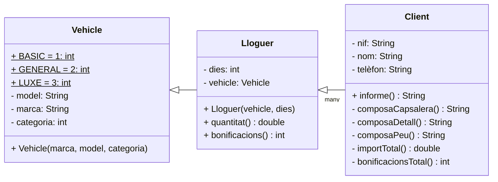

@startuml
actor Usuari

Usuari -> unClient: informe()
activate unClient

unClient -> unClient: composaCapsalera()
activate unClient
unClient --> unClient: nom
unClient --> unClient: nif
return capçalera

unClient -> unClient: composaDetall()
activate unClient
loop for each Lloguer
    unClient -> unLloguer: getVehicle()
    activate unLloguer
    unLloguer --> unClient: vehicle
    unClient -> unVehicle: getMarca()
    unVehicle --> unClient: marca
    activate unVehicle
    unClient -> unVehicle: getModel()
    unVehicle --> unClient: model
    unClient -> unLloguer: quantitat()
    unLloguer -> unVehicle: getCategoria()
    deactivate unVehicle
    deactivate unLloguer
end
return detall

unClient -> unClient: composaPeu()
activate unClient
unClient -> unClient: importTotal()
activate unClient
loop for each Lloguer
    unClient -> unLloguer: quantitat()
    activate unLloguer
    unLloguer -> unVehicle: getCategoria()
    activate unVehicle
    deactivate unVehicle
    deactivate unLloguer
end
return importTotal
unClient -> unClient: bonificacionsTotal()
activate unClient

loop for each Lloguer
    unClient -> unLloguer: bonificacions()
    activate unLloguer
    unLloguer -> unVehicle: getCategoria()
    activate unVehicle
    deactivate unVehicle
    deactivate unLloguer
end
return bonificacionsTotal
return peu

return informe
@enduml