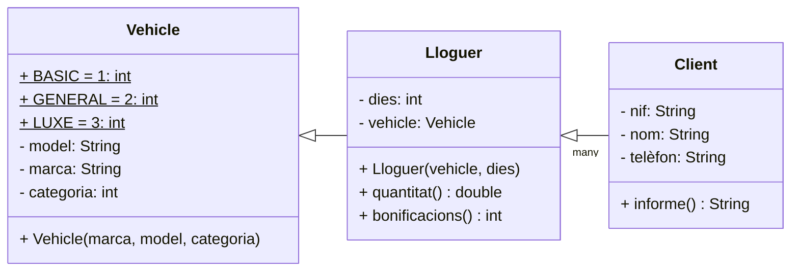
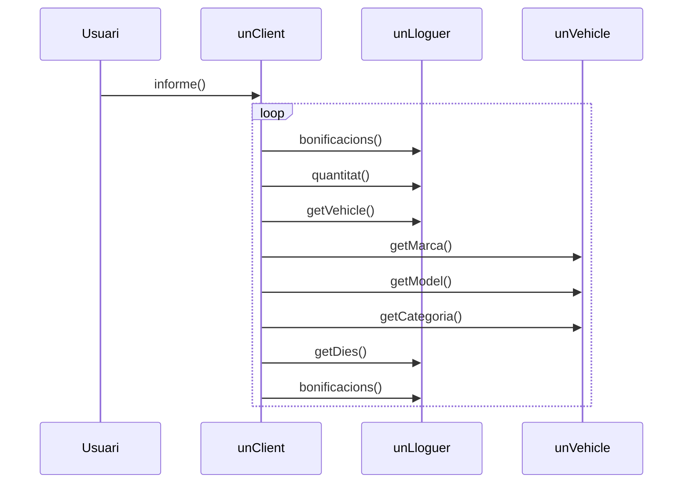

```mermaid
classDiagram
direction RL
class Vehicle{
    + BASIC = 1: int$
    + GENERAL = 2: int$
    + LUXE = 3: int$

    - model: String
    - marca: String
    - categoria: int
    + Vehicle(marca, model, categoria)
}

class Lloguer{
    - dies: int
    - vehicle: Vehicle
    + Lloguer(vehicle, dies)
    + quantitat() double
    + bonificacions() int
}

class Client{
    - nif: String
    - nom: String
    - telèfon: String
    + informe() String
}

Lloguer --|> Vehicle
Client --|> "many" Lloguer

```

```mermaid
sequenceDiagram

    Usuari->>unClient: informe()
    
    loop
        unClient->>unLloguer: bonificacions()
        unClient->>unLloguer: quantitat()
        unClient->>unLloguer: getVehicle()
        unClient->>unVehicle: getMarca()
        unClient->>unVehicle: getModel()
        unClient->>unVehicle: getCategoria()
        unClient->>unLloguer: getDies()
        unClient->>unLloguer: bonificacions()
    end

```