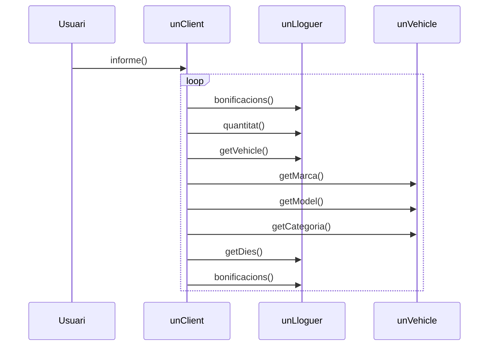

```mermaid
sequenceDiagram

    Usuari->>unClient: informe()
    
    loop
        unClient->>unLloguer: bonificacions()
        unClient->>unLloguer: quantitat()
        unClient->>unLloguer: getVehicle()
        unClient->>unVehicle: getMarca()
        unClient->>unVehicle: getModel()
        unClient->>unVehicle: getCategoria()
        unClient->>unLloguer: getDies()
        unClient->>unLloguer: bonificacions()
    end
```